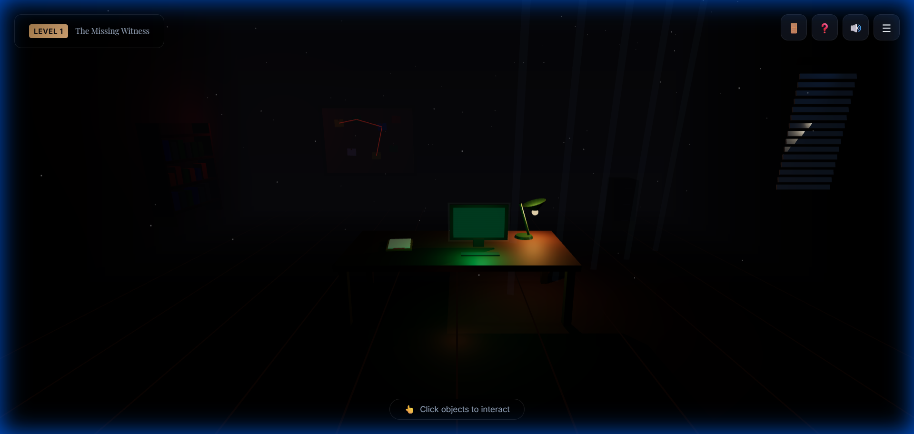

# 🔍 SQL Detective: The Data Crime Investigation Game

<div align="center">


**An immersive SQL learning game where players solve crimes using database queries in a 3D noir detective environment.**

[Play Demo](#getting-started) • [Features](#features) • [SQL Concepts](#sql-concepts-covered) • [Screenshots](#screenshots) • [Resume Points](#resume-bullet-points)

</div>

---

## 🖼️ Screenshots

<div align="center">



*Immersive 3D detective office with interactive objects, atmospheric lighting, and SQL terminal*

</div>


## 📖 Overview

SQL Detective is an interactive game that teaches SQL through crime investigation. Players take on the role of a data detective, solving a bank heist by querying realistic crime databases in an immersive 3D noir environment.

### 🎯 Key Highlights

- **7 Progressive Levels** - From basic SELECT to advanced Window Functions
- **3D Interactive Environment** - Noir detective office built with Three.js
- **Real Database Queries** - Execute actual SQL against a SQLite database
- **Secure by Design** - Read-only queries, SQL injection prevention
- **Instant Feedback** - Helpful hints and error messages

---

## ✨ Features

### 🎮 Gameplay
- Click-to-interact 3D detective room
- Case files with compelling crime narratives
- Evidence board showing available database tables
- Terminal-style SQL editor with syntax highlighting
- Real-time query execution and result display

### 🛡️ Security
- Read-only database connection (SELECT only)
- Blocked dangerous keywords (DROP, DELETE, UPDATE, etc.)
- Query timeout protection
- Input sanitization against SQL injection

### 📊 SQL Teaching
- Progressive difficulty from beginner to advanced
- Contextual hints when stuck
- Immediate feedback on query correctness
- Real-world scenario-based learning

---

## 📚 SQL Concepts Covered

| Level | Concepts | Mission |
|-------|----------|---------|
| 1 | `SELECT`, `WHERE`, `AND` | Find suspects over 30 with criminal records |
| 2 | `BETWEEN`, `ORDER BY`, `LIMIT` | Find calls during the crime window |
| 3 | `INNER JOIN`, Foreign Keys | Link suspects to CCTV sightings |
| 4 | `GROUP BY`, `HAVING`, `COUNT` | Find callers with unusual call patterns |
| 5 | Subqueries, `AVG` | Find transactions above average |
| 6 | CTEs (`WITH` clause) | Track suspect movement timeline |
| 7 | Window Functions (`RANK`, `LAG`) | Analyze transaction patterns |

---

## 🚀 Getting Started

### Prerequisites

- Python 3.8+
- Modern web browser (Chrome, Firefox, Edge)

### Installation

1. **Clone the repository**
   ```bash
   git clone https://github.com/ananyabshetty/SQL-Detective-Game.git
   cd SQL-Detective-Game
   ```

2. **Install Python dependencies**
   ```bash
   pip install -r requirements.txt
   ```

3. **Run the application**
   ```bash
   cd backend
   python app.py
   ```

4. **Open in browser**
   ```
   http://localhost:5000
   ```

The database will be automatically initialized with seed data on first run.

---

## 🏗️ Project Structure

```
SQL Based Detective Game/
├── backend/
│   ├── app.py                 # Flask application
│   ├── config.py              # Configuration
│   ├── database/
│   │   ├── schema.sql         # Database schema
│   │   ├── seed_data.sql      # Seed data
│   │   └── detective_game.db  # SQLite database
│   ├── routes/
│   │   ├── game.py            # Game progression API
│   │   └── query.py           # Query execution API
│   ├── services/
│   │   ├── sql_validator.py   # SQL security validation
│   │   ├── query_executor.py  # Safe query execution
│   │   └── level_checker.py   # Answer verification
│   └── levels/
│       └── level_config.py    # All 7 level definitions
├── frontend/
│   ├── index.html             # Main HTML
│   ├── css/
│   │   ├── main.css           # Global styles
│   │   ├── sql-editor.css     # Editor styles
│   │   └── ui-panels.css      # Panel styles
│   └── js/
│       ├── main.js            # Game entry point
│       ├── scene/
│       │   └── DetectiveRoom.js  # 3D environment
│       └── api/
│           └── gameAPI.js     # Backend communication
├── requirements.txt
└── README.md
```

---

## 🎮 How to Play

1. **🖱️ Navigate the Room** - Use mouse to look around the detective office
2. **📁 Read Case File** - Click the desk to read the crime story and objective
3. **📌 View Evidence** - Click the evidence board to see available database tables
4. **💻 Write Queries** - Click the computer to open the SQL terminal
5. **✅ Submit Answer** - Execute your query and submit when ready
6. **🔓 Unlock Levels** - Correct answers unlock the next level

---

## 📊 Database Schema

```
┌──────────────┐     ┌──────────────┐     ┌──────────────┐
│   suspects   │     │ phone_records│     │   cctv_logs  │
├──────────────┤     ├──────────────┤     ├──────────────┤
│ id (PK)      │◄────│ caller_id    │     │ person_id    │───►│
│ name         │     │ receiver_id  │     │ location_id  │
│ age          │     │ timestamp    │     │ timestamp    │
│ occupation   │     │ duration     │     │ confidence   │
│ criminal_rec │     └──────────────┘     └──────────────┘
└──────────────┘             │                    │
                             ▼                    ▼
                    ┌──────────────┐     ┌──────────────┐
                    │  locations   │     │bank_transact │
                    ├──────────────┤     ├──────────────┤
                    │ id (PK)      │     │ account_id   │───►│suspects│
                    │ name         │     │ amount       │
                    │ type         │     │ timestamp    │
                    └──────────────┘     └──────────────┘
```

---

## 🔮 Future Enhancements

- [ ] Sound effects and ambient audio
- [ ] Additional crime cases/campaigns
- [ ] Query history and statistics
- [ ] Leaderboard system
- [ ] Mobile-responsive design
- [ ] Multiplayer mode
- [ ] PostgreSQL/MySQL dialect options

---

## 🤝 Contributing

Contributions are welcome! Please feel free to submit a Pull Request.

---


<div align="center">

**Built with ❤️ for SQL learners everywhere**

⭐ Star this repo if you found it helpful!

</div>
